## README for saddle measurements.

I'll put all the data here for an upcoming paper.  I'll keep a log of other stuff in the README for the saddle project at https://github.com/roberthart56/SCFAB/tree/master/SC_lab/Projects/rotating_saddle

### Data from Jan 12, 2021.

[link to jupyter notebook](.Saddle_data_Jan_12_2021/Saddle_data_Jan_12_2021.ipynb)

[link to md version, from which data can be harvested](Saddle_data_Jan_12_2021/Saddle_data_Jan_12_2021.md)

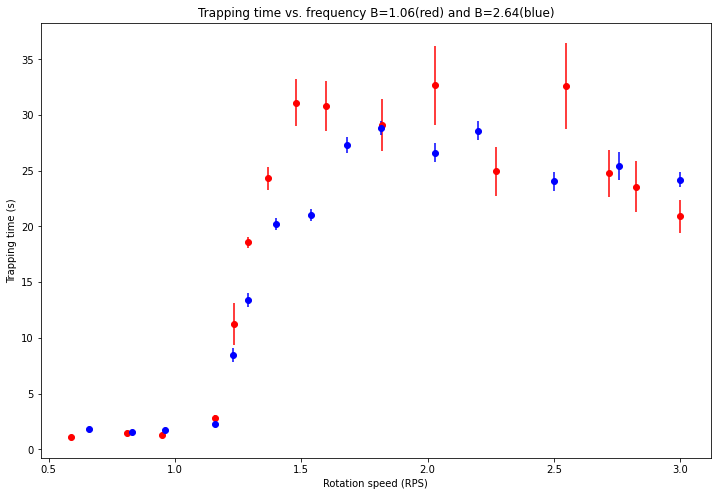

### Data from Jan 19, 2021.

[link to jupyter notebook](.Saddle_data_Jan_19_2021/Saddle_data_Jan_19_2021.ipynb)

[link to md version, from which data can be harvested](Saddle_data_Jan_19_2021/Saddle_data_Jan_19_2021.md)

### Parameters for saddles, derived from height measurements.

[link to jupyter notebook](./Saddle_parameters/Saddle_heights.ipynb)

[link to md version, from which data can be harvested](./Saddle_parameters/Saddle_heights.md)

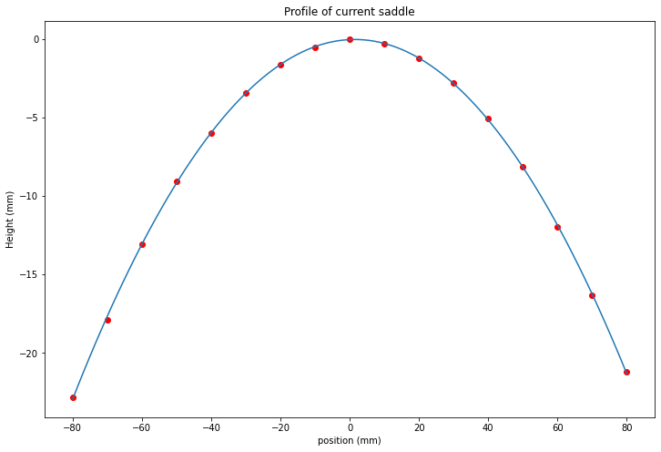

Table below, with parameters derived from five plastic saddles.
 
 | Saddle  | Positive coeff. (mm-1) | Negative coeff. (mm-1) | Beta|
| ---|-------------------- |-------------------- |---------- |
| W1 | 0.00290 | -0.00249 | 1.16 |
| W2 | 0.00281 | -0.00281 |  1.00  |
| P1 | 0.00270 | -0.00297|  0.91  |
| P2 | 0.00267 | -0.00251 |  1.06  |
| P3 | 0.00267 | -0.000997 |  2.68  |
| P4 | 0.00267 | -0.00466 |  0.57  |
| P5 | 0.00268 | -0.00349 |  0.77  |
| P6 | 0.00717 |-0.00271 | 2.65   |

### Data from Feb 1-2, 2021.

All data is in Jupyter notebooks.

#### Showing data distribution.

Took repeated measurements of lifetime for P2 and P3 at 1.50 rps.  Data shown in red for P3 and blue for P2.  

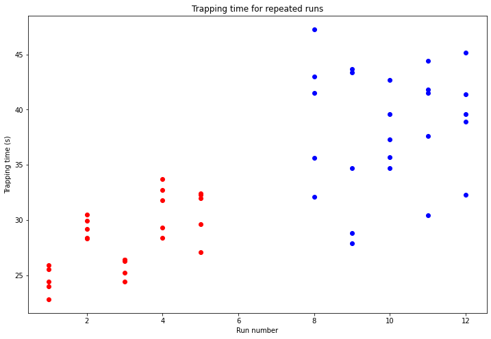

#### New set of data from Feb 1-2.

This data set is taken with little pause, and the setup unchanged.  Some aspects of the setup that may be important:

* Launcher is re-centered each time a saddle is changed by using a pencil to mark center of rotation, and then adjusting launcher to put ball at center.  To do this, tape a template to the saddle and adjust the ball holder to the ball position.
* Saddle is levelled at each change.
* Using stepper motor with Arduino board driving an L298 h-bridge module.
* Check NB for comments about points to examine.  Interesting changes in SD between adjacent readings.  Some nearly stable orbits.

Below is data from the four plastic saddles: P2-red, P3-blue, P4-yellow, P5-green.

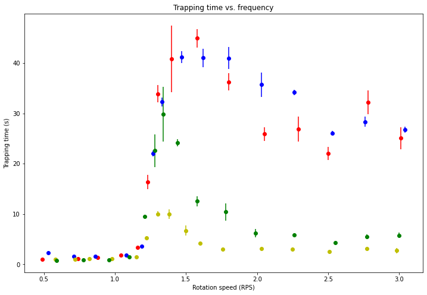

Plot on q-a diagram.  Note that color maps are normalized to each data set. This makes the transitions and regions of relative stability clear on the plot.  It may also be misleading - we need to be careful about presenting this data this way. 

#### Superimposed data from Saddles P3 and P6

* P6 and P3 have the same BETA (~2.65), But negative curvature of P6 matches positive curvature of P3 (nearly).  They have transitions at very different frequencies in real space.

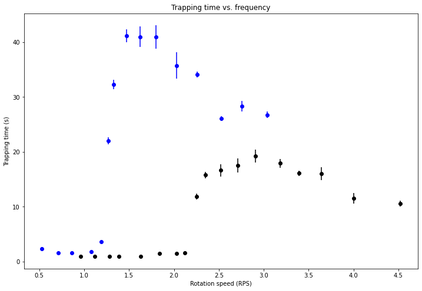

* Below, the same data is plotted as a function of q, and normalized to maximum.

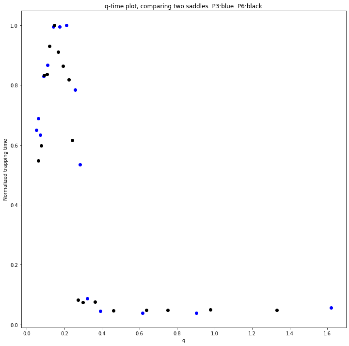

* Here, the data from P6 is included on the a-q plot, with the P6 data offset vertically.

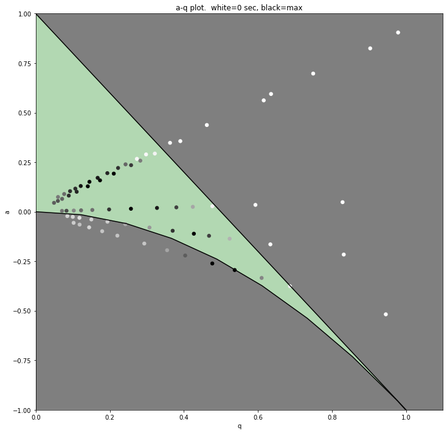.

#### Data with Liquid nitrogen.  Feb 9, 2021.

Took data with liquid nitrogen and compared to steel ball.  I could not do this with the usual plastic surfaces, because the LN stuck to the surface.  I need a smoother surface to get nice drop levitation.  I used instead the wood saddle, W1, which has an epoxy coating.  Its parameters give a natural frequency for the positive curvature of 1.20 rps.  This saddle has Beta=1.16.  Note that the steel ball measurement has not been made before in a complete way on this surface.  We are still not comparing LN to data that we have already taken.

[jupyter notebook](./Saddle_data_Feb_09_2021/Saddle_data_Feb_09_2021.ipynb)

[jupyter notebook, markdown version](./Saddle_data_Feb_09_2021/Saddle_data_Feb_09_2021.md)

Below is the raw data with LN2 and steel ball on this surface.  For LN2, I recorded movies, and estimated the length of time during which I could see droplets remaining on the saddle.  The steel ball data is taken in the usual way, with five points at each frequency.

[links to movies will be here]

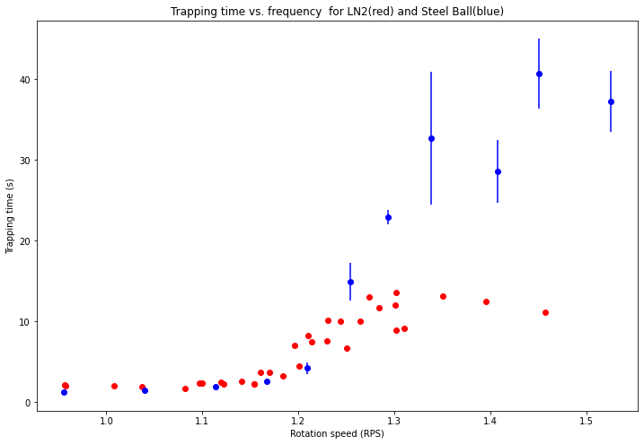

Below, the data is normalized to the maxima in each set.  Not clear that this is fair, since the LN2 lifetime is probably limited to ~15 s. Droplets evaporate in that time.  So the top of that curve should be infinite?  Maybe the most that we can say is that the LN2 curve begins to rise before the ball curve, even on the raw data plot.  We have shown a difference in the behavior of LN2 drops.  Since the drops can't live long enough to compare with abll data, this may be all that we can say.  Maybe enough?????

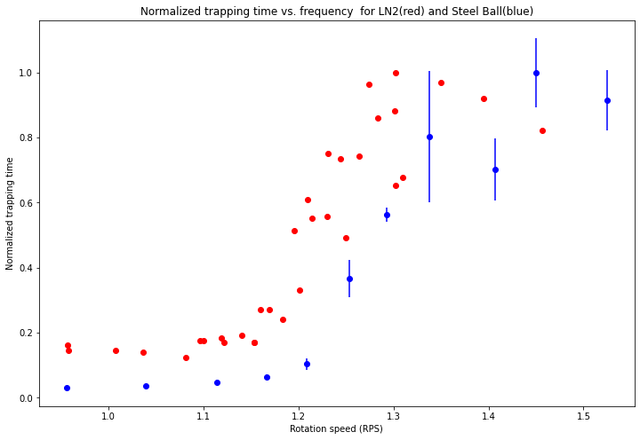

#### Feb 12-15, 2021.  Liquid Nitrogen Data for all four plastic saddles.

I coated all four saddles with epoxy and polished with 600 grit, micromesh, pumice and rottenstone to a lumpy but reflective finish.  Nitrogen droplets can live several seconds (~<=15).

Below is the raw data.

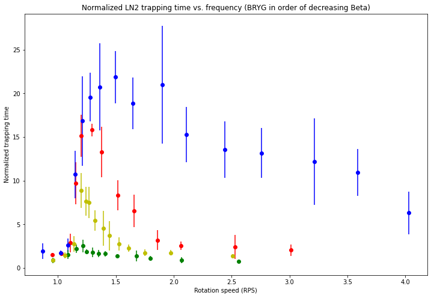

And the scatter plot, in which each dataset is normalized individually in the clormap.

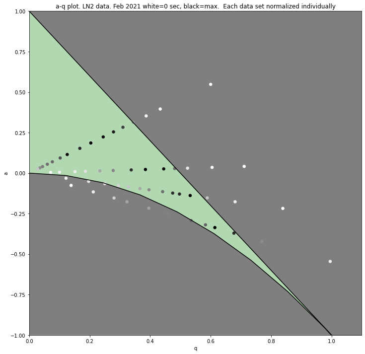

#### Feb 24, 2021.  Transition data for balls of three diameters, compared to LN2.

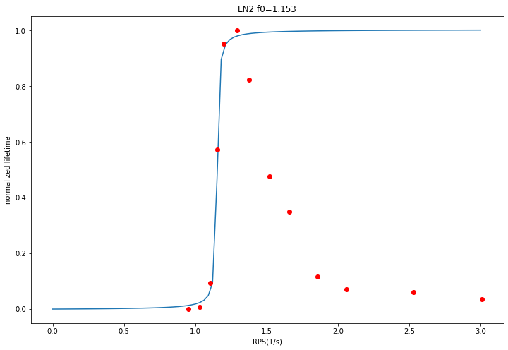

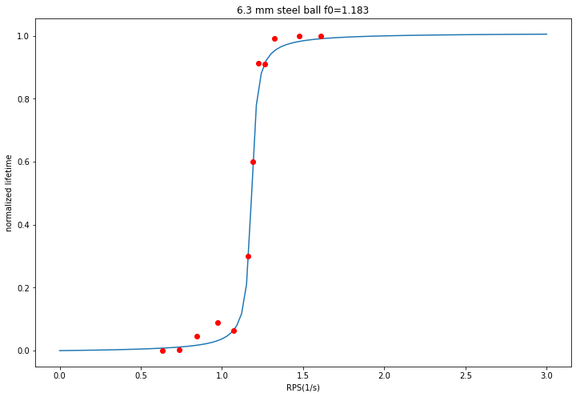

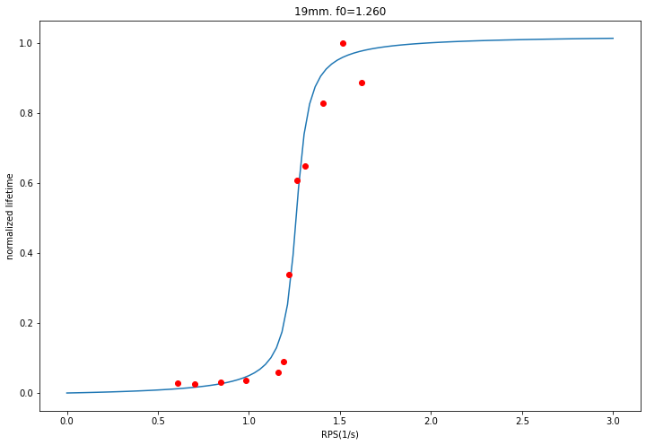

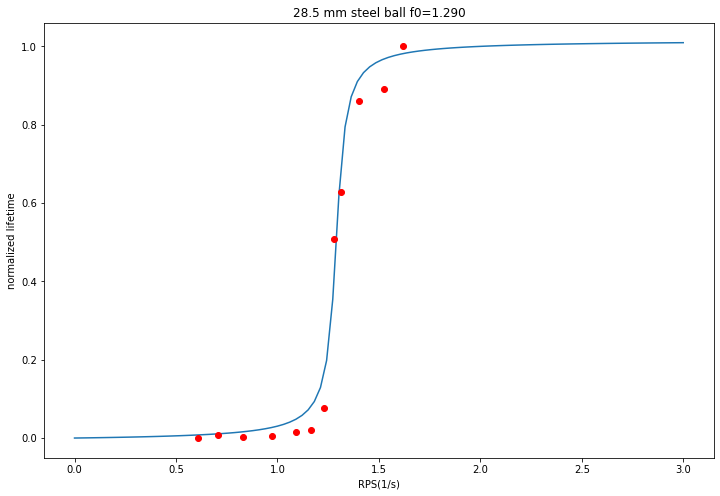

