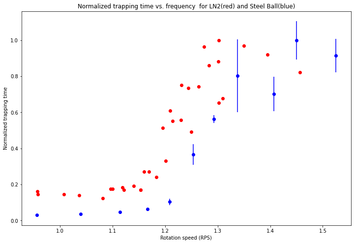
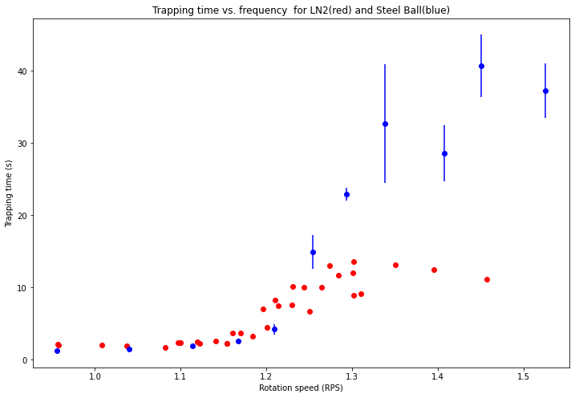

```python
    import numpy as np
    import matplotlib.pyplot as plt

    #Data for W1 with liquid nitrogen drops
    rps_1 = np.array([1.082, 1.154, 1.184, 1.210, 1.231, 1.274, 1.284, 0.957, 1.008, 1.097, 1.170, 1.196, 1.244,
                      1.301, 1.037, 1.119, 1.160, 1.214, 1.264, 1.302, 0.958, 1.100, 1.154, 1.201, 1.250, 1.310,
                     1.122, 1.230, 1.302, 1.350, 1.395, 1.457, 1.141])
#     times_1 = np.array([[1.8, 2.2, 1.5, 1.1, 2.0],
#                         [0.93, 2.1, 2.1, 2.1, 4.0, 2.8],
#                         [1.5, 2.2, 3.5, 5.6, 3.6, 2.6, 1.5, 4.7, 3.0, 4.9],
#                         [8.9, 5.6, 6.9, 10.3, 7.1, 8.8, 9.4, 9.0],
#                         [11.0, 9.0, 9.7, 10.4, 10.7], 
#                         [12.7, 13.4],
#                         [11.1, 11.7, 12.7, 8.3, 14.4, 11.9],
#                         [1.7, 2.3, 2.6, 3.2, 1.7, 2.1, 1.7],
#                         [1.5, 1.5, 1.6, 2.3, 2.0, 2.4, 2.5, 1.8, 2.0],
#                         [1.7, 1.8, 2.4, 2.4, 1.5, 1.7, 4.5, 3.0, 2.3, 3.0],
#                         [1.9, 3.3, 4.4, 6.1, 3.9, 4.0, 3.3, 3.3, 3.7, 3.0, 3.7],
#                         [6.6, 6.7, 5.0, 7.0, 9.5],
#                         [12.0, 10.0, 8.0, 11.5, 8.5],
#                         [11.8, 11.8, 12.4],
#                         [1.9, 2.1, 3.3, 1.7, 1.6, 1.5, 1.3],
#                         [1.7, 3.3, 2.6, 2.5, 3.2, 2.2, 2.5, 1.5, 2.6],
#                         [2.0, 2.8, 3.2, 3.0, 3.0, 3.8, 2.8, 3.4, 4.1, 8.0, 3.4, 4.3],
#                         [6.0, 8.0, 8.5, 7.4],
#                         [13.3, 10.3, 11.0, 5.8],
#                         [10.0, 7.6, 7.8, 10.2],
#                         [1.9, 1.5, 2.0, 2.8, 1.9, 1.7],
#                         [2.5, 1.5, 2.1, 1.8, 3.6, 2.1, 2.4, 2.0, 2.8, 2.8, 2.6, 2.3, 2.6, 2.0],
#                         [1.7, 2.2, 1.3, 2.5, 2.2, 2.2, 2.6, 2.8, 3.1, 2.3],
#                         [3.5, 4.0, 5.5, 5.7, 2.8, 5.8, 4.5],
#                         [7.7, 9.6, 4.6, 5.6],
#                         [10.3, 5.8, 11.4],
#                         [1.6, 2.0, 3.0, 2.5, 1.9, 2.0, 3.2, 2.2],
#                         [4.3, 4.4, 6.0, 7.3, 7.7, 12.0, 11.2, 7.9],
#                         [15.5, 13.1, 13.7, 10.0, 15.4, 16.3, 11.4, 13.2],
#                         [11.9, 11.7, 17.6, 14.3, 10.3, 13.6],
#                         [8.6, 12.7, 8.4, 12.5, 16.4, 15.9, 14.6, 11.2],
#                         [10.5, 11.5, 9.5, 11.5, 13.2, 14.1, 7.9, 11.4],
#                         [2.5, 1.9, 3.6, 2.2, 1.8, 2.0, 2.6, 3.2, 3.4, 2.3]]) 
    
    mean_times_1 = np.array([1.7, 2.3, 3.3, 8.3, 10.2, 13.1, 11.7, 2.2, 2.0, 2.4, 3.7, 7.0, 10.0, 12.0,
                            1.9, 2.5, 3.7, 7.5, 10.1, 8.9, 2.0, 2.4, 2.3, 4.5, 6.7, 9.2, 
                            2.3, 7.6, 13.6, 13.2, 12.5, 11.2, 2.6])
    #error_bars_1 = np.std(times_1, axis = 1)    #/np.sqrt(5)
    
    
    
    
    rps_2 = np.array([0.956, 1.040, 1.114, 1.167, 1.209, 1.254, 1.293, 1.338, 1.407, 1.450, 1.525])
    times_2 = np.array([[1.8, 1.2, 1.1, 1.2, 1.1],
                        [1.3, 1.9, 1.6, 1.6, 1.3],
                        [2.4, 1.6, 1.3, 1.9, 2.3],
                        [3.2, 3.7, 2.2, 1.6, 2.4],
                        [7.2, 4.0, 3.5, 3.9, 2.6],
                        [11.0, 9.6, 14.1, 24.4, 15.6],
                        [22.4, 25.1, 20.7, 21.0, 25.5],
                        [16.3, 28.5, 19.5, 31.6, 67.8],
                        [30.1, 23.8, 15.8, 42.1, 31.0],
                        [47.0, 48.2, 48.9, 35.8, 23.8],
                        [43.4, 31.5, 50.8, 29.3, 31.2]])
    
    mean_times_2 = np.mean(times_2, axis = 1)
    error_bars_2 = np.std(times_2, axis = 1)/np.sqrt(5)
    #mean_times_2
    
   
    #mean_times_2
    
    fig = plt.figure(figsize=(12, 8))
    plt.title('Normalized trapping time vs. frequency  for LN2(red) and Steel Ball(blue)')
    plt.xlabel('Rotation speed (RPS)')
    plt.ylabel('Normalized trapping time')
    #plt.errorbar(rps_1, mean_times_1,   yerr=error_bars_1, fmt='or')
    #plt.errorbar(rps_2, mean_times_2,   yerr=error_bars_2, fmt='ob')
    plt.errorbar(rps_2, mean_times_2/max(mean_times_2),   yerr=error_bars_2/max(mean_times_2), fmt='ob')
    #plt.errorbar(rps_3, mean_times_3,   yerr=error_bars_3, fmt='oy')
    
    plt.plot(rps_1, mean_times_1/max(mean_times_1), 'ro')
    
    plt.show()
    
    
    fig = plt.figure(figsize=(12, 8))
    plt.title('Trapping time vs. frequency  for LN2(red) and Steel Ball(blue)')
    plt.xlabel('Rotation speed (RPS)')
    plt.ylabel('Trapping time (s)')
    #plt.errorbar(rps_1, mean_times_1,   yerr=error_bars_1, fmt='or')
    #plt.errorbar(rps_2, mean_times_2,   yerr=error_bars_2, fmt='ob')
    plt.errorbar(rps_2, mean_times_2,   yerr=error_bars_2, fmt='ob')
    #plt.errorbar(rps_3, mean_times_3,   yerr=error_bars_3, fmt='oy')
    
    plt.plot(rps_1, mean_times_1, 'ro')
    
    plt.show()
```


    

    


    

    


```python
mean_times_1, mean_times_2
```


    (array([ 1.7,  1.2,  3.3,  8.3, 10.2, 13.1, 11.7,  2.2,  2. ,  2.4,  3.7,
             7. , 10. , 12. ,  1.9,  2.5,  3.7,  7.5, 10.1,  8.9,  2. ,  2.4,
             2.3,  4.5,  6.7,  9.2,  2.3,  7.6, 13.6, 13.2, 12.5, 11.4,  2.6]),
     array([ 1.28,  1.54,  1.9 ,  2.62,  4.24, 14.94, 22.94, 32.74, 28.56,
            40.74, 37.24]))


```python

```
