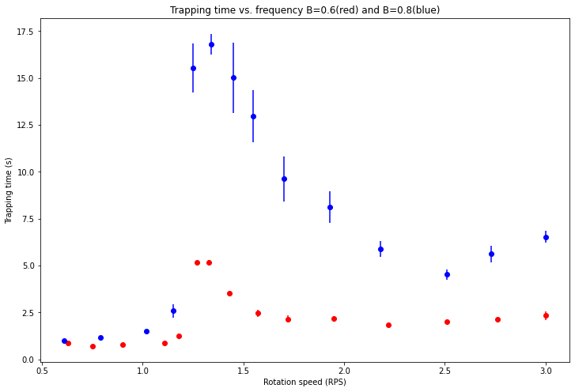

```python
    import numpy as np
    import matplotlib.pyplot as plt

    #Data for P4.  Beta = 0.6.  Very negative.
    rps_1 = np.array([0.63, 0.75, 0.90, 1.11, 1.18, 1.27, 1.33, 1.43, 1.57, 1.72, 1.95, 2.22, 2.51, 2.76, 3.00])
    times_1 = np.array([[0.69, 0.86, 0.80, 0.99, 0.94],
                        [0.80, 0.73, 0.68, 0.67, 0.74],
                        [0.80, 0.80, 0.81, 0.67, 0.79],
                        [0.80, 0.92, 0.87, 0.87, 0.99],
                        [1.12, 1.3, 1.4, 1.3, 1.1],
                        [5.4, 5.2, 4.7, 5.4, 5.2],
                        [5.4, 5.3, 5.3, 4.6, 5.3],
                        [3.9, 3.1, 3.6, 3.6, 3.5],
                        [3.2, 2.4, 2.2, 1.9, 2.6],
                        [2.9, 2.0, 2.0, 1.6, 2.2],
                        [1.6, 2.4, 2.4, 2.0, 2.4],
                        [2.0, 2.1, 1.6, 2.0, 1.5],
                        [1.9, 2.2, 1.9, 2.1, 1.9],
                        [1.8, 2.4, 2.2, 1.7, 2.5],
                        [1.7, 3.0, 1.8, 2.4, 2.8]])
    
    mean_times_1 = np.mean(times_1, axis = 1)
    error_bars_1 = np.std(times_1, axis = 1)/np.sqrt(5)
    #mean_times_1
    
    
    #Data for P5. Beta approx = 0.80  
    rps_2 = np.array([0.61, 0.79, 1.02, 1.15, 1.25, 1.34, 1.45, 1.55, 1.70, 1.93, 2.18, 2.51, 2.73, 3.00])
    times_2 = np.array([[0.9, 0.9, 1.3, 1.0, 0.9],
                        [1.3, 1.1, 1.3, 1.1, 1.1],
                        [1.5, 1.3, 1.3, 1.8, 1.6],
                        [1.9, 1.8, 4.1, 2.3, 2.8],
                        [16.8, 14.4, 12.4, 20.6, 13.5],
                        [15.6, 18.5, 18.1, 15.5, 16.3],
                        [21.9, 16.2, 9.2, 15.0, 12.8],
                        [8.5, 18.2, 13.0, 12.1, 13.1],
                        [11.2, 9.5, 8.5, 13.4, 5.5],
                        [10.4, 9.2, 7.8, 8.5, 4.7],
                        [6.7, 6.3, 6.4, 6.0, 4.1],
                        [5.6, 3.7, 4.5, 4.3, 4.5],
                        [4.5, 4.9, 6.0, 7.4, 5.3],
                        [5.7, 7.3, 5.6, 7.1, 7.0]])
    
    mean_times_2 = np.mean(times_2, axis = 1)
    error_bars_2 = np.std(times_2, axis = 1)/np.sqrt(5)
    #mean_times_2
    
   
    #mean_times_2
    
    #fig = plt.figure()
    fig = plt.figure(figsize=(12, 8))
    plt.title('Trapping time vs. frequency B=1.06(red) and B=2.64(blue)')
    plt.xlabel('Rotation speed (RPS)')
    plt.ylabel('Trapping time (s)')
    plt.errorbar(rps_1, mean_times_1,   yerr=error_bars_1, fmt='or')
    plt.errorbar(rps_2, mean_times_2,   yerr=error_bars_2, fmt='ob')
    #plt.errorbar(rps_3, mean_times_3,   yerr=error_bars_3, fmt='oy')
    
    #plt.plot(rps_1, mean_times_1, 'ro')
    
    plt.show()
```


    

    


```python

```
