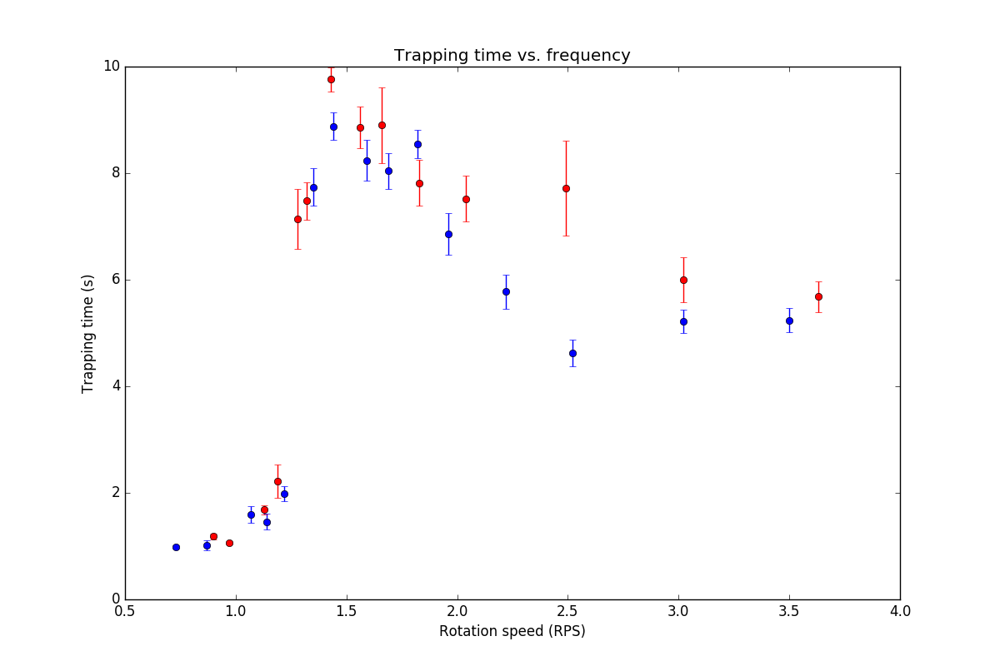
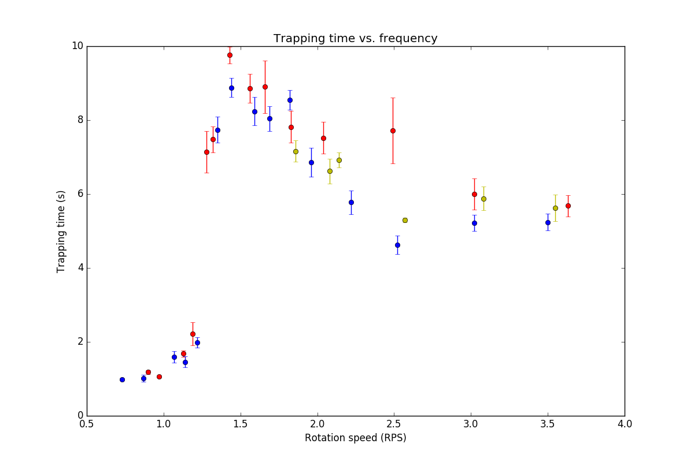
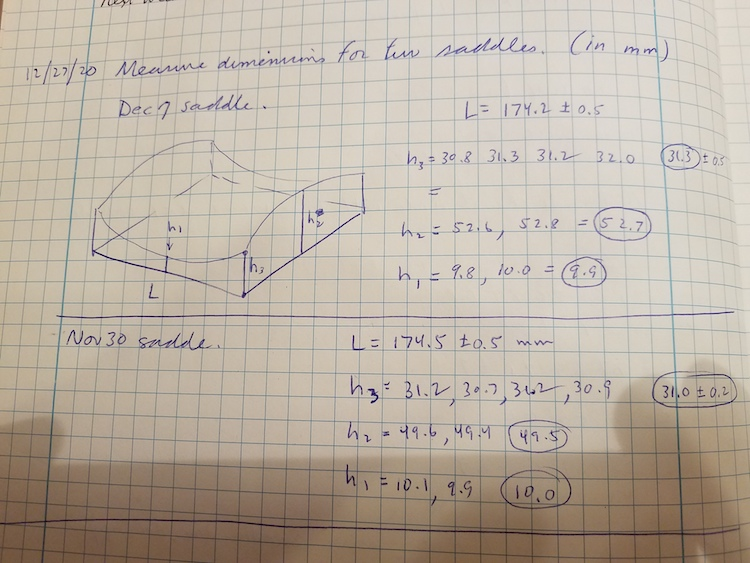
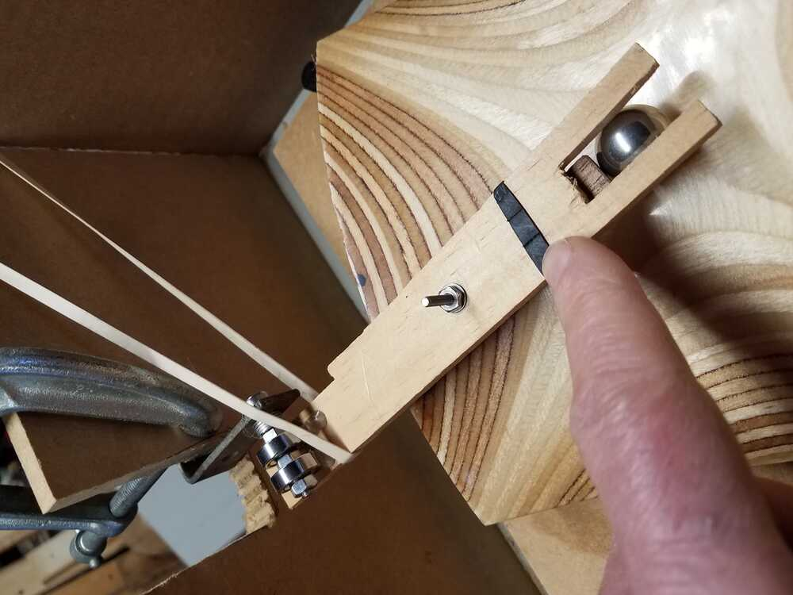
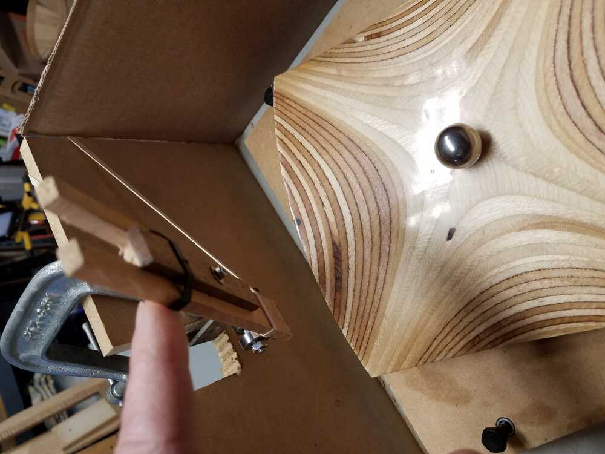

Readme file for saddle project.

Prior work is documented [here](https://roberthart56.github.io/SCFAB/SC_lab/Projects/rotating_saddle/index.html)

**Dec 7-9.** 

Data below uses:
 - Five readings per data point.  Error bars give SD on the mean = SD/sqrt(5).
 - Bare sanded wood saddles.  One is slightly positive (red) and one slightly negative (blue).
 - Levelled saddles, on three bearings.
 - 19mm Polyethylene ball, released at center.
 

[Jupyter Notebook for Dec. 7, with data for the two cases.](./Measurements/Dec7_data_nb.ipynb)

The difference at 2.5 RPS is probably significant.  Also consistent with earlier (10/30/20) results with a larger ball.  Any theoretical reason for this?

Next steps:
 - Explore role of friction.  Teflon coating, teflon ball, coated wood, steel ball.  Compare lifetimes at ~1.5 RPS
 - Go back and check 3D printed surfaces.  They may be adequate.  It would be nice to report in the paper that this method works.
 - Explore other low friction non-rolling alternatives.
 - Do a careful measurement of z(x,y) for all surfaces.
 - Design a launcher, to minimize and/or characterize dependence on initial conditions.
 
To answer questions about friction and rolling, how about studying flat plates (acrylic, epoxy, 3D PLA, etc) rotating, with sliding and rolling particles?  Should be able to solve for this motion analytically.  Will that tell us anything about the connection between rolling data and unobtainable sliding data on curved surfaces?

**Dec 10.**

Explored lubricants, cleaning, surface finish.  Kept to f=1.60-1.66 RPS  NB 5 P1
 
* Plain sanded wood (matches data from 12/7) uses later saddle with alpha<1. :
  * Polyethylene 19mm: mean=8.6 SD=0.8
  * PTFE 19mm:  8.4 +/- 1.1
  * Steel 19mm: 10.2 +/- 1.3
  
* Epoxy coated wood, using earlier saddle with alpha>1.:
  * Polyethylene 19mm: mean=10.0 SD=0.8
  * PTFE 19mm:  10.1 +/- 1.0
  * Steel 19mm: 14.7 +/- 1.3
  
Following measurements all use steel ball

* Spray surface with Dry PTFE lubricant: 14.6 +/- 1.3
* Clean saddle, spray ball with dry PTFE: 20.2 +/- 1.2
* Spray surface with Wet teflon lubricant:  7-8 s
* Clean saddle, clean ball IPA: 25 +/- 4.
* Spray ball dry film, dry 5 min: 17 +/- 2.
* Clean ball IPA: 36 +/- 9.
* sand off some bumps, clean IPA; 24 +/- 3.
* Polish to shiny:  33 (N=3)
* Light spray with dry lubricant on saddle:  31 (N=3).
* Clean saddle.  Light spray ball with dry lub:  25 (N=3).
* Clean all with IPA:  32.5 +/- 3.3 N=5.

Conclusion that residual lubricant when cleaned with IPA may help.  No order-of-magnitude changes with lubrication.

  
  
 
Video link:  https://youtu.be/w8pZ9PfglKk  to movie of two  runs 20-30 seconds on clean surface, as at end of above list.

Next steps, after discussion with Louis and Carey:
* Reexamine points >= 2.5 for bare-wood alpha<1 surface.
* Take a good movie, with marked ball with the bare wood surface.
* coat the surface.
* take data again with both surfaces.  Consider how to control initial conditions. Make a launcher.

**Dec11**

Reexamine points as suggested above, for alpha<1 surface. Figure below shows new points in yellow.  Compare with blue points, from earlier under same conditions.

**Dec14**

Now, take movies at 1.5 and at 3.0 with ball and plate marked.

**Dec27**

Measure dimensions of two saddles, with ruler and calipers.  Below is a figure with numbers!

**Jan4, 2021**

Work on getting both coated surfaces working, and making a better setup, including a launcher:

**Jan 5, 2021**

Talk with Louis.

 * Do a careful measurement of surface dimensions of existing saddles.
  * Mount up 3D printed saddles to account for warpage.
  * Pay attention to area within about 3 cm from center.  Are we within a few x10 microns?
  * Calculate parameters
 * Move quickly to data needed to this paper!  I think that we should get good data for Beta=1, 0.6, and 2.6.  Distinctions betwen Beta=1 and Beta=1.12 are interesting, but too detailed for this early.  We need to see clear difference and match trapping behavior to stability plots. 
 * I need to improve setup a bit - new part on launcher, and steel bolts on leveling.  Think about returning to stepper for ability to dial in speed.
 
 **Jan 9, 2021**
 
 Below are results from measuring and fitting height data from five saddles NB 12/20 pp 6-9 and p.13
 [link to python notebook html shapshot](./Measurements/Saddle_h_Jan7_2021.pdf)
 
 [link to python notebook itself](./Measurements/Saddle_parameters/Saddle_heights.ipynb)
 
 | Saddle  | Positive coeff. (mm-1) | Negative coeff. (mm-1) | Beta|
| ---|-------------------- |-------------------- |---------- |
| W1 | 0.00290 | -0.00249 | 1.16 |
| W2 | 0.00281 | -0.00281 |  1.00  |
| P1 | 0.00270 | -0.00297|  0.91  |
| P2 | 0.00267 | -0.00251 |  1.06  |
| P3 | 0.00267 | -0.000997 |  2.68  |

**Jan 11 and 12, 2021**
 
Revised measuring apparatus and mounted two plastic saddles.  Took data sets with 19mm steel ball on each.
 * Improved launcher.
 * Mounted plastic (PETG) surfaces on plywood and used shims to level.  Will take a height data set on each to verify level.
 * Made new (P3) surface on Jan10 with Beta=2.64, and verified that number.  (Still need detailed fit to curve).
 * Replaced DC motor with stepper for better precision.  OK at 12V up to 3 RPS.
 
 Link to a Markdown version of the Python jupyter notebook [here](./Measurements/Saddle_data_Jan_12_2021/Saddle_data_Jan_12_2021.md).
 
 Looks like the transition frequencies end up inside the stable region on the q-a curve.  

